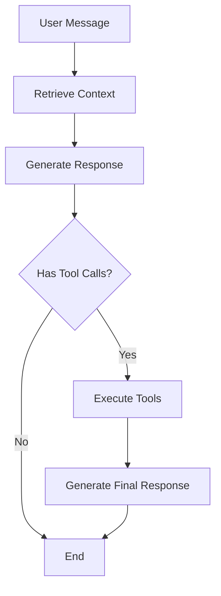

# 🤖 Rhea - FounderBot

A production-ready Telegram bot with long-term memory capabilities using LangGraph, PostgreSQL vector storage, and LangSmith for observability.

### Features
- **🧠 Long-term Memory**: Uses `pgvector` for similarity search across conversation history.
- **🔄 Stateful Conversations**: Manages complex interactions using LangGraph and PostgreSQL for check-ins.
- **🔭 Observability & Evaluation**: Integrates with LangSmith for tracing, monitoring, and debugging.
- **🐳 Dockerized**: Comes with `docker-compose` for easy and reproducible deployments.
- **⚡ Async Architecture**: Built on Node.js for high-performance, concurrent operations.
- **🛠️ Tool Integration**: Composio tools for email, calendar, docs, and more.

### Technology Stack
- **Backend**: Node.js, TypeScript
- **AI Framework**: LangChain.js (`LangGraph`)
- **LLM**: Google Gemini (`gemini-2.5-flash`)
- **Embeddings**: Google Gemini (`text-embedding-004`)
- **Vector Store**: PostgreSQL with `pgvector`
- **Checkpointer**: PostgreSQL
- **Observability**: LangSmith
- **Containerization**: Docker, Docker Compose
- **Tools**: Composio

---

### Quick Start

1.  **Clone the repository:**
    ```bash
    git clone https://github.com/sdntsng/rhea.git
    cd rhea
    ```

2.  **Set up environment:**
    Copy the example `.env` file and fill in your credentials.
    ```bash
    cp .env.example .env
    ```

3.  **Start the services:**
    ```bash
    docker-compose up --build
    ```

### Configuration

Your `.env` file should contain the following keys:

| Environment Variable  | Description                                        |
| --------------------- | -------------------------------------------------- |
| `TELEGRAM_BOT_TOKEN`  | Your token from Telegram's @BotFather.             |
| `GEMINI_API_KEY`      | Your Google AI API key.                            |
| `DATABASE_URL`        | PostgreSQL connection string for `pgvector`.       |
| `LANGCHAIN_TRACING_V2`| Set to `true` to enable LangSmith.                 |
| `LANGCHAIN_API_KEY`   | Your API key for LangSmith.                        |
| `COMPOSIO_API_KEY`    | Your API key for Composio.                         |

---

## 🧠 How Memory and Intelligence Works

Rhea uses a sophisticated multi-layered architecture that combines **vector-based memory**, **stateful conversations**, and **tool integration** to provide intelligent, context-aware responses.

### 📊 Architecture Overview

```
User Message → LangGraph Workflow → Response
     ↓              ↓                   ↓
  Vector DB    Conversation State    Tool Calls
 (Long-term)    (Short-term)       (Real-time)
```

### 🔄 The LangGraph Workflow

Rhea's intelligence is powered by a **LangGraph StateGraph** with the following flow:



#### **1. State Management**
```typescript
interface AgentState {
    question: string;        // Current user question
    context: string;         // Retrieved relevant history
    answer: AIMessage;       // LLM response with potential tool calls
    history: BaseMessage[];  // Conversation thread history
}
```

#### **2. Workflow Nodes**

**🔍 Retrieve Node** (`retrieve`)
- Converts user question to vector embeddings using `text-embedding-004`
- Performs similarity search against conversation history in PostgreSQL
- Retrieves **top 2 most relevant** past messages/responses
- Passes context to next node

**🧠 Generate Node** (`generate`)
- Combines retrieved context + conversation history + current question
- Uses system prompt that includes tool descriptions
- Invokes Google Gemini with tool bindings
- Returns response (potentially with tool calls)

**🛠️ Tools Node** (`tools`) 
- Executes any tool calls from the LLM response
- Maps tool names to Composio tool instances
- Handles errors gracefully with fallback messages
- Returns tool outputs as ToolMessages

**✨ Generate After Tools** (`generate_after_tools`)
- Takes tool outputs and generates final human-readable response
- Synthesizes tool results into natural language

### 💾 Memory Systems

#### **1. Long-term Memory (Vector Database)**

**Storage Process:**
1. **User Message Ingestion**: Every user message is converted to vectors and stored
2. **Bot Response Ingestion**: Every bot response is also vectorized and stored
3. **Metadata Tracking**: Each message includes `{ type: 'user'|'bot', threadId }`

**Retrieval Process:**
1. **Question Vectorization**: New user question → embedding vector
2. **Similarity Search**: Compare against all stored conversation vectors
3. **Context Selection**: Return top 2 most relevant historical messages
4. **Context Injection**: Relevant history becomes part of system prompt

#### **2. Short-term Memory (Checkpointer)**

**PostgreSQL Checkpointer** stores:
- **Thread State**: Complete conversation state per `thread_id`
- **Message History**: All messages in current conversation thread
- **Tool Execution History**: Records of tools used and outputs
- **State Persistence**: Maintains state between bot restarts

**Thread Management:**
- Each Telegram chat gets unique `thread_id` (chat ID)
- Conversation state is automatically loaded/saved
- History accumulates across entire conversation

### 🎯 System Prompting

#### **Base System Prompt**
```typescript
`You are Rhea, a helpful AI assistant with access to powerful tools. You can:

🔧 **Available Tools:**
- **Email**: Check, send, and manage Gmail
- **Calendar**: Schedule, view, and manage Google Calendar events  
- **Documents**: Create, edit, and manage Google Docs and Sheets
- **File Management**: Access and organize Google Drive files
- **Communication**: Send messages via Discord
- **Project Management**: Manage tasks and projects in Notion and Linear
- **Development**: Interact with GitHub repositories

📋 **Instructions:**
- Answer questions based on the provided context and conversation history
- Use tools when the user requests actions (checking email, scheduling, etc.)
- Be proactive about suggesting tool usage when relevant
- Always be helpful and informative

🔍 **Context from previous conversations:**
${retrievedContext}

Remember: You have access to the user's connected accounts through Composio tools!`
```

#### **Context Injection**
- **Retrieved Context**: Top 2 relevant messages from vector search
- **Conversation History**: All messages from current thread
- **Tool Descriptions**: Available Composio tools with schemas

### 🛠️ Tool Calling Mechanism

#### **Tool Discovery**
```typescript
const availableTools = await toolset.getTools();
const modelWithTools = model.bindTools(availableTools);
```

#### **Tool Execution Flow**
1. **LLM Decision**: Model decides to call tools based on user request
2. **Tool Mapping**: Map tool names to actual Composio tool instances  
3. **Parallel Execution**: Execute multiple tools simultaneously if needed
4. **Result Processing**: Convert tool outputs to ToolMessages
5. **Final Generation**: LLM synthesizes tool results into response

#### **Error Handling**
- **Tool Not Found**: Graceful fallback with error message
- **Execution Errors**: Catch exceptions and return error details
- **Timeout Handling**: Prevent hanging on slow tool calls

### 🔄 Message Flow Example

**User**: "Check my email"

1. **Retrieve**: Search vector DB for email-related conversations
2. **Generate**: LLM sees request + context + tool schemas → decides to call Gmail tool
3. **Tools**: Execute `gmail_check_inbox` tool via Composio
4. **Generate After Tools**: Convert tool output to natural language response

**User**: "Who emailed me yesterday about the project?"

1. **Retrieve**: Find relevant context (might include previous email discussions)
2. **Generate**: LLM sees context suggests checking recent emails → calls Gmail tools
3. **Tools**: Execute `gmail_search` with yesterday's date filter  
4. **Generate After Tools**: Summarize found emails in user-friendly format

### 🎛️ Configuration Parameters

| Parameter | Value | Purpose |
|-----------|-------|---------|
| **Similarity Search Limit** | 2 documents | Balance context vs noise |
| **Embedding Model** | `text-embedding-004` | High-quality vector representations |
| **LLM Model** | `gemini-2.5-flash` | Fast, capable reasoning |
| **Thread Persistence** | PostgreSQL | Reliable state management |
| **Tool Timeout** | 30s | Prevent hanging operations |

### 📈 Memory Efficiency

- **Selective Retrieval**: Only top relevant messages, not entire history
- **Conversation Chunking**: Long conversations broken into manageable pieces
- **Token Management**: System prompts optimized for token efficiency
- **State Compression**: Checkpointer efficiently stores conversation state

---

### Connected Tools (via Composio)

Rhea has access to the following tools, allowing it to perform a wide range of actions on your behalf:

- **Collaboration**: Notion, Linear
- **Communication**: Gmail, Discord
- **Scheduling**: Google Calendar
- **File Management**: Google Drive, Google Docs, Google Sheets
- **Development**: GitHub

---

### Development

To run the bot in a development environment with hot-reloading:
```bash
docker-compose -f docker-compose.dev.yml up --build
```

### Project Structure
```
rhea/
├── src/
│   ├── agent/       # Core LangGraph agent definition
│   ├── db/          # Database connection & schema
│   └── telegram/    # Telegram bot adapter logic
├── .env.example     # Environment variable template
├── docker-compose.yml # Production Docker configuration
├── package.json
└── tsconfig.json
```