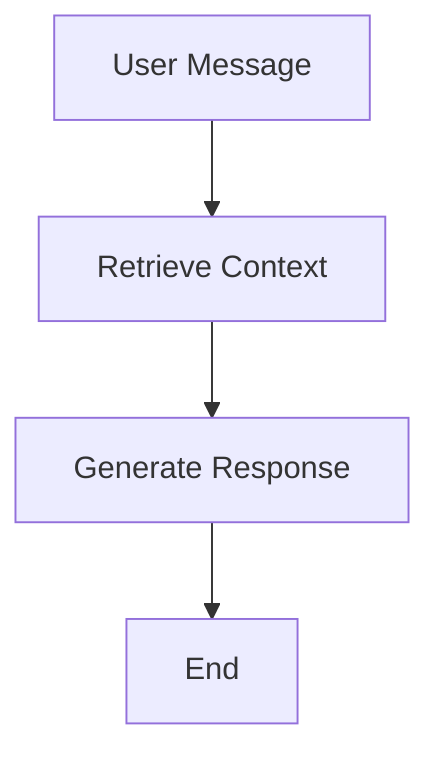

# 🤖 Rhea - FounderBot

A production-ready Telegram bot with long-term memory capabilities using LangGraph and PostgreSQL vector storage.

### Features
- **🧠 Long-term Memory**: Uses `pgvector` for similarity search across conversation history.
- **🔄 Stateful Conversations**: Manages complex interactions using LangGraph and PostgreSQL for check-ins.
- **🔭 Observability & Evaluation**: Integrates with LangSmith for tracing, monitoring, and debugging.
- **🐳 Dockerized**: Comes with `docker-compose` for easy and reproducible deployments.
- **⚡ Async Architecture**: Built on Node.js for high-performance, concurrent operations.

### Technology Stack
- **Backend**: Node.js, TypeScript
- **AI Framework**: LangChain.js (`LangGraph`)
- **LLM**: Google Gemini (`gemini-2.5-flash`)
- **Embeddings**: Google Gemini (`text-embedding-004`)
- **Vector Store**: PostgreSQL with `pgvector`
- **Checkpointer**: PostgreSQL
- **Observability**: LangSmith
- **Containerization**: Docker, Docker Compose

---

### Quick Start

1.  **Clone the repository:**
    ```bash
    git clone https://github.com/sdntsng/rhea.git
    cd rhea
    ```

2.  **Set up environment:**
    Copy the example `.env` file and fill in your credentials.
    ```bash
    cp .env.example .env
    ```

3.  **Start the services:**
    ```bash
    docker-compose up --build
    ```

### Configuration

Your `.env` file should contain the following keys:

| Environment Variable  | Description                                        |
| --------------------- | -------------------------------------------------- |
| `TELEGRAM_BOT_TOKEN`  | Your token from Telegram's @BotFather.             |
| `GEMINI_API_KEY`      | Your Google AI API key.                            |
| `DATABASE_URL`        | PostgreSQL connection string for `pgvector`.       |
| `LANGCHAIN_TRACING_V2`| Set to `true` to enable LangSmith.                 |
| `LANGCHAIN_API_KEY`   | Your API key for LangSmith.                        |

---

## 🧠 How Memory and Intelligence Works

Rhea uses a multi-layered architecture that combines **vector-based memory** and **stateful conversations** to provide intelligent, context-aware responses.

### 📊 Architecture Overview

```
User Message → LangGraph Workflow → Response
     ↓              ↓
  Vector DB    Conversation State
 (Long-term)    (Short-term)
```

### 🔄 The LangGraph Workflow

Rhea's intelligence is powered by a **LangGraph StateGraph** with the following flow:



#### **1. State Management**
```typescript
interface AgentState {
    question: string;        // Current user question
    context: string;         // Retrieved relevant history
    history: BaseMessage[];  // Conversation thread history
}
```

#### **2. Workflow Nodes**

**🔍 Retrieve Node** (`retrieve`)
- Converts user question to vector embeddings using `text-embedding-004`
- Performs similarity search against conversation history in PostgreSQL
- Retrieves **top 2 most relevant** past messages/responses
- Passes context to next node

**🧠 Generate Node** (`generate`)
- Combines retrieved context + conversation history + current question
- Invokes Google Gemini to generate a response

### 💾 Memory Systems

#### **1. Long-term Memory (Vector Database)**

**Storage Process:**
1. **User Message Ingestion**: Every user message is converted to vectors and stored
2. **Bot Response Ingestion**: Every bot response is also vectorized and stored
3. **Metadata Tracking**: Each message includes `{ type: 'user'|'bot', threadId }`

**Retrieval Process:**
1. **Question Vectorization**: New user question → embedding vector
2. **Similarity Search**: Compare against all stored conversation vectors
3. **Context Selection**: Return top 2 most relevant historical messages
4. **Context Injection**: Relevant history becomes part of system prompt

#### **2. Short-term Memory (Checkpointer)**

**PostgreSQL Checkpointer** stores:
- **Thread State**: Complete conversation state per `thread_id`
- **Message History**: All messages in current conversation thread
- **State Persistence**: Maintains state between bot restarts

**Thread Management:**
- Each Telegram chat gets unique `thread_id` (chat ID)
- Conversation state is automatically loaded/saved
- History accumulates across entire conversation

### 🎯 System Prompting

#### **Base System Prompt**
```typescript
`You are Rhea, a helpful AI assistant.

📋 **Instructions:**
- Answer questions based on the provided context and conversation history.
- Always be helpful and informative.

🔍 **Context from previous conversations:**
${retrievedContext}`
```

#### **Context Injection**
- **Retrieved Context**: Top 2 relevant messages from vector search
- **Conversation History**: All messages from current thread

### 🎛️ Configuration Parameters

| Parameter | Value | Purpose |
|-----------|-------|---------|
| **Similarity Search Limit** | 2 documents | Balance context vs noise |
| **Embedding Model** | `text-embedding-004` | High-quality vector representations |
| **LLM Model** | `gemini-2.5-flash` | Fast, capable reasoning |
| **Thread Persistence** | PostgreSQL | Reliable state management |

### 📈 Memory Efficiency

- **Selective Retrieval**: Only top relevant messages, not entire history
- **Conversation Chunking**: Long conversations broken into manageable pieces
- **Token Management**: System prompts optimized for token efficiency
- **State Compression**: Checkpointer efficiently stores conversation state

---

### Development

To run the bot in a development environment:
```bash
docker-compose up --build
```

### Project Structure
```
rhea/
├── src/
│   ├── agent/       # Core LangGraph agent definition
│   ├── config/      # Configuration for models
│   ├── db/          # Database connection & schema
│   └── telegram/    # Telegram bot adapter logic
├── .env.example     # Environment variable template
├── docker-compose.yml # Production Docker configuration
├── package.json
└── tsconfig.json
```